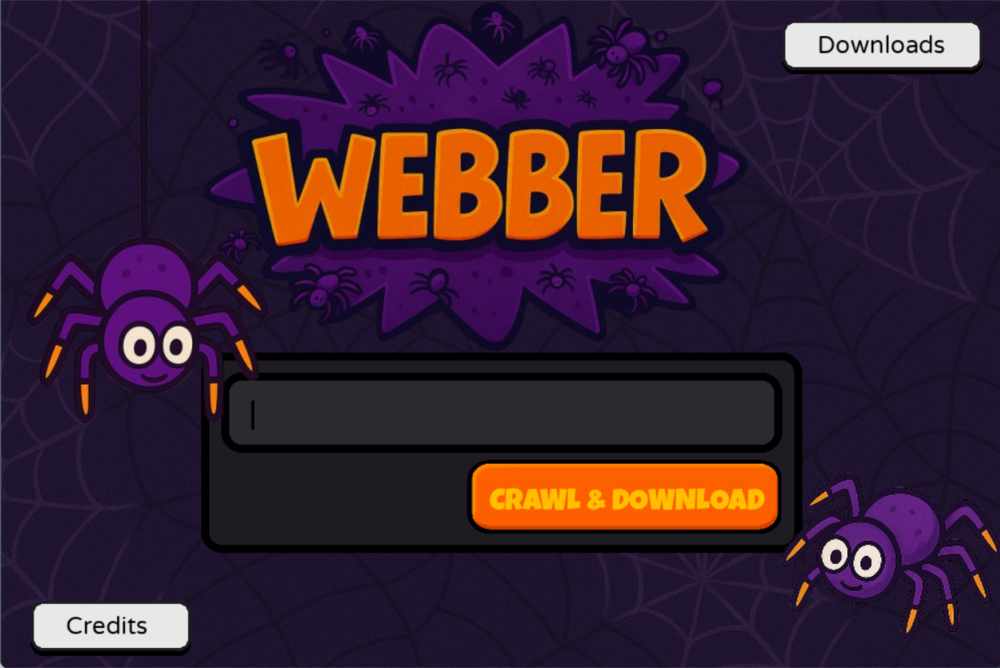

<!-- PROJECT LOGO -->
<div align="center">
  <a href="https://github.com/YogyaChugh/Webber">
    
  </a>


  <p align="center">
  <br>
    A simple & easy way to download websites locally so you don't have to stay online all the time.
    <br />
    <a href="https://github.com/YogyaChugh/Webber"><strong>Explore the docs »</strong></a>
    <br />
  </p>
</div>


<!-- TABLE OF CONTENTS -->
<details>
  <summary>Table of Contents</summary>
  <ol>
    <li>
      <a href="#about-the-project">About The Project</a>
      <ul>
        <li><a href="#built-with">Built With</a></li>
      </ul>
    </li>
    <li>
      <a href="#getting-started">Getting Started</a>
      <ul>
        <li><a href="#prerequisites">Prerequisites</a></li>
        <li><a href="#installation">Installation</a></li>
      </ul>
    </li>
    <li><a href="#usage">Usage</a></li>
    <li><a href="#roadmap">Roadmap</a></li>
    <li><a href="#contributing">Contributing</a></li>
    <li><a href="#license">License</a></li>
    <li><a href="#contact">Contact</a></li>
    <li><a href="#acknowledgments">Acknowledgments</a></li>
  </ol>
</details>


<!-- ABOUT THE PROJECT -->
## About The Project



Want to download a website for later or want to cut yourself off from the Internet for a while, just download the important websites. Whether it's some website for reading docs or a website for personal usage, Webber got you covered.

It stores files locally and is strictly restricted for usage on websites which permit downloading and don't restrict this behavior.

Websites like `www.youtube.com` don't allow this and it's advised to follow the same. This project is only for educational purposes. It neither spreads any form of misinformation nor promotes non-abidement of policies.


### Built With

[](https://www.python.org/)
[](https://www.pygame.org/)
[](https://pywebview.flowrl.com/)
[](https://www.crummy.com/software/BeautifulSoup/)
[](https://python-pillow.org/)
[](https://pypi.org/project/cssbeautifier/)
[](https://pypi.org/project/jsbeautifier/)


<!-- GETTING STARTED -->
## Getting Started

You can get the precompiled exe's for your platform from the Releases Section or set up the project locally using the instructions below.

### Prerequisites

Setting up an environment is a must !

* Windows
    ```bash
      python -m venv .env
      .env\Scripts\activate
    ```
* Linux \ MacOS
    ```bash
      python3 -m venv .env
      source .env/bin/activate
    ```

### Installation

Requirements for the project can be set-up using the following `pip` command on all platforms.
```bash
  pip install -r requirements.txt
```


## Usage

Running the project can be done in 2 ways !
* **Using GUI**
  > Run `python src/main.py` or `python3 src/main.py` from the WEBBER directory which will open the pygame window for you.

* Command Line
  > Run `python src/website.py` with the following non-optional args:-
  - URL
  - Download Resources (True/False)
  - Download Cors Resources for same origin links (True/False)
  - Cross Origin links to be scraped ? (True/False)
  - Download Resources for CORS links (True/False)
  - Download CORS Resources for CORS links (True/False) (Never set to True)
  - Max CORS links to be scraped (integer)
  - Same Origin Deviation (integer) (should be min 2)
  - Location (string) ('.' is perfect)
  - Maintain Logs ? (True/False)
  - Show Failed Files ? (True/False)
  - Refetch (True/False)
  - Hash Value (Any random integer)
  - Max Threads (It can be as low as 3 or as high as 500 ! Depends on ur system !)
  - Resources to Ignore (Empty dict is perfect)
  - Webpages to Ignore (Empty dict is perfect)

> Basic Command
```bash
  python src/website.py some_url True True False False False 0 2 . True True True 12344 50 {} {}
```


<!-- CONTRIBUTING -->
## Contributing

Contributions are what make the open source community such an amazing place to learn, inspire, and create. Any contributions you make are **greatly appreciated**.

If you have a suggestion that would make this better, please fork the repo and create a pull request. You can also simply open an issue with the tag "enhancement".
Don't forget to give the project a star! Thanks again!


<!-- LICENSE -->
## License

Distributed under the Creative Commons CC0 1.0 License. See <a href="https://github.com/YogyaChugh/Webber/blob/master/LICENSE">`LICENSE`</a> for more information.


<!-- CONTACT -->
## Contact

Yogya Chugh

yogya.developer@gmail.com / yogyachugh.coder@gmail.com

[LinkedIn@me](https://www.linkedin.com/in/yogya-chugh-464a45304/)

[Slack@me]('https://hackclub.slack.com/team/U09218J0E94')


<!-- ACKNOWLEDGMENTS -->
## Acknowledgments

Credits to all the resources used can be found <a href="https://webber-credits.onrender.com">here</a>
